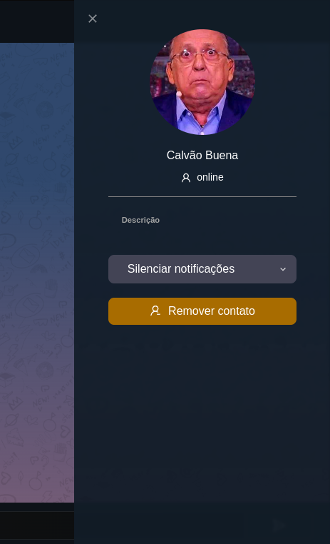

## **Componente MenuPrivateUser**
O componente MenuPrivateUser é utilizado para exibir informações detalhadas sobre um usuário específico em um menu lateral. Ele apresenta a imagem de perfil, nome, status, descrição e opções de notificação e remoção do usuário.



## **Descrição**
O MenuPrivateUSer exibe as informações do usuário em uma conversa privada. Ele inclui o avatar do usuário, nome, status online/offline, descrição e opções para silenciar notificações e remover o contato.
## **Funcionalidades Principais**
- Exibição das informações do usuário em uma conversa privada.
- Opções para silenciar notificações e remover o contato.

## **Props Principais**
- `recipient`:  As informações do usuário, incluindo nome, avatar e descrição.
- `onClose`: Função de retorno de chamada chamada quando o menu é fechado.

- # **Componentes Renderizados**
- `ProfileImage`: componente que exibe a imagem de perfil do usuário.
- `ProfileName`: : componente que exibe o nome do usuário.
- `DescriptionUsers`: componente que permite silenciar as notificações do usuário.
- `SilenceNotifications`:  componente que exibe um botão para remover o usuário.
- [`ButtonRemove`](../Components/ButtonRemoveContact/ButtonRemoveContact.md):  componente que exibe um botão para remover o usuário.
- `Icon`: componente para ícones diversos (neste caso, um ícone de fechar).
- `UserOutlined`:  ícone que representa o status do usuário.
## **Exemplo de Uso**
```javascript
    const recipient: Recipient = { nome: "John Doe", avatar: "avatar.jpg", descricao: "Lorem ipsum dolor sit amet" }

    <MenuPrivateUSer recipient={recipient} onClose={() => console.log('Fechado')} />
```